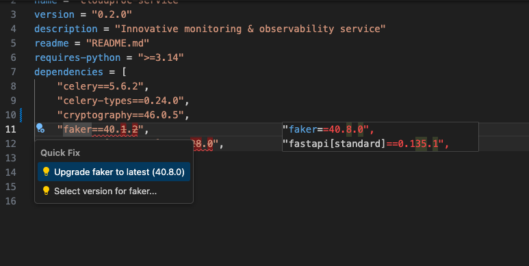
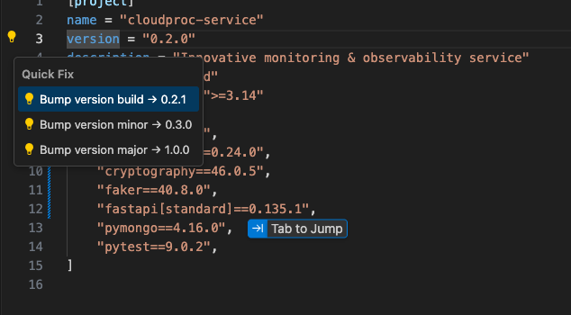

# UV VS Code Integration

A VS Code extension for working with `pyproject.toml` files generated by [uv](https://github.com/astral-sh/uv). Provides TOML syntax highlighting, dependency version management via PyPI, and project version bumping.

## Features

### 🔍 Outdated Dependency Detection

Automatically checks your dependencies against PyPI and highlights outdated versions with inline diagnostics.



### ⚡ Quick Fix: Upgrade to Latest

Click the lightbulb (or press `Cmd+.` / `Ctrl+.`) on an outdated dependency to instantly upgrade it to the latest version.

### 📋 Version Selection

Choose from all available versions on PyPI via a quick pick menu.

### 📦 Project Version Bumping

Place your cursor on the `version = "x.y.z"` line under `[project]` and bump the major, minor, or build version:

- **Bump build** — `0.1.0` → `0.1.1`
- **Bump minor** — `0.1.0` → `0.2.0`
- **Bump major** — `0.1.0` → `1.0.0`



### 🐍 Python Version Management

Same bump actions on the `requires-python` line. Supports both 2-part (`>=3.14`) and 3-part (`>=3.14.1`) versions.

Additionally, use **"Select Python version…"** to pick from all Python 3.x releases (3.0–3.14) via a quick pick menu.

### 🔧 Hover Information

Hover over a package name in a dependency section to see its latest PyPI version with a link to the project page.

### 🖥️ UV Commands

Run common `uv` commands directly from the command palette (`Cmd+Shift+P`):

| Command | Description |
|---------|-------------|
| `UV: Sync` | Run `uv sync` |
| `UV: Add` | Add a package via `uv add` |
| `UV: Run` | Run a command via `uv run` |

## Supported Sections

The extension detects dependencies in:

- `[project]` → `dependencies = [...]`
- `[project]` → `optional-dependencies.* = [...]`
- `[dependency-groups]` → `dev = [...]`, etc.

## Requirements

- VS Code `^1.85.0`
- Internet access for PyPI lookups

## Development

```bash
# Install dependencies
npm install

# Compile
npm run compile

# Watch for changes
npm run watch
```

Press `F5` to launch the Extension Development Host for testing.

## License

MIT
