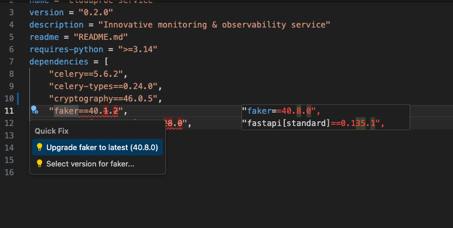
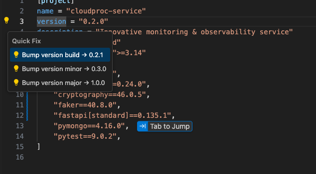

# Practical UV

A VS Code extension for working with Python dependency files. Supports both [uv](https://github.com/astral-sh/uv) / PEP 621 `pyproject.toml` and pip's `requirements.txt`. Provides TOML syntax highlighting, dependency version management via PyPI, known-vulnerability detection via the OSV advisory database, and project version bumping.

## Features

### 🔍 Outdated Dependency Detection

Automatically checks your dependencies against PyPI and highlights outdated versions with inline diagnostics. Works in both `pyproject.toml` and `requirements.txt`.



### 🛡️ Security Advisories (opt-in)

Checks your declared dependencies against the [OSV](https://osv.dev) advisory database — the PyPA Advisory Database and GitHub Security Advisories — and reports known vulnerabilities as diagnostics, with the CVE, its severity, and the version that fixes it.

**This is off by default.** Enable `uv.security.enabled` to turn on background checking, or run **UV: Check Dependencies for Security Advisories** once from the command palette without changing the setting.

Findings appear in four places: as squiggles and Problems-panel entries (with a clickable link to the advisory on osv.dev), in the hover for the package, as a **Upgrade … (fixes CVE-…)** quick fix, and in a Security column in the dependency dashboard. When a package carries several advisories wanting different floors, the quick fix picks the highest version, so one bump clears them all.

#### Checking a single dependency

Press `Cmd+.` / `Ctrl+.` on any dependency and the code-action menu offers **Check `<package>` for security advisories** next to the usual version options — **Re-check** once results already exist. It checks that one package rather than the whole file, so it is available even while `uv.security.enabled` is off, and it leaves findings for the rest of the file untouched.

The result distinguishes *clean* from *unverifiable*. A dependency with no `uv.lock` entry and no `==` pin has no exact version to check against, so instead of reporting "no advisories" it tells you how many its declared range permits and points you at `uv.security.includeRangeFindings`.

#### How versions are resolved

An advisory applies to a *concrete* version, but a dependency is usually declared as a range. Two cases:

- **Exact** — the version comes from `uv.lock` (if it sits next to your `pyproject.toml`) or from an `==` pin. The finding means *you are affected*.
- **Range** — no lockfile and no pin, so the check reports advisories your declared constraint merely *permits*. Accurate but noisy: an open constraint like `requests>=2.0` permits every advisory ever published for that package. These are hidden unless you set `uv.security.includeRangeFindings`.

Only your **top-level** declared dependencies are checked. `uv.lock` is read solely to pin those to exact versions — its transitive tree is never queried, so every finding is fixable by editing the file in front of you. The trade-off is that a vulnerability in a package you did not declare will not be reported.

#### Privacy

Enabling this sends the names and versions of your declared dependencies to `api.osv.dev`. Nothing else leaves your machine, and no request is made while the setting is off unless you run the command explicitly.

### 🐍 Pip / `requirements.txt` Support

The extension auto-detects pip-style files and applies the same outdated-detection, hover, code actions, and dashboard. Recognized files:

- `requirements.txt`
- `requirements-*.txt` and `requirements_*.txt` (e.g. `requirements-dev.txt`)
- Any `*.txt` inside a `requirements/` directory

Comments (`#`), blank lines, pip directives (`-r`, `-e`, `-c`, `--index-url`, …), direct URL specs (`pkg @ https://…`), and PEP 508 environment markers (`; python_version >= "3.8"`) are handled correctly.

### 🚀 Convert pip Project to uv

When a `requirements.txt` file is the active editor, a **`$(arrow-up) Convert to uv`** action appears in the status bar (and **UV: Convert requirements.txt to uv project** is available in the command palette).

It runs the appropriate sequence in the integrated terminal at the workspace folder root:

- If no `pyproject.toml` exists: `uv init` followed by `uv add -r <requirements file>`
- If `pyproject.toml` already exists: just `uv add -r <requirements file>` to import the deps

You'll be prompted to confirm before anything is executed.

### ⚡ Quick Fix: Upgrade to Latest

Click the lightbulb (or press `Cmd+.` / `Ctrl+.`) on an outdated dependency to instantly upgrade it to the latest version. The same menu offers a per-dependency security check — see [Security Advisories](#️-security-advisories-opt-in).

### 📋 Version Selection

Choose from all available versions on PyPI via a quick pick menu.

### 📦 Project Version Bumping (`pyproject.toml` only)

Place your cursor on the `version = "x.y.z"` line under `[project]` and bump the major, minor, or build version:

- **Bump build** — `0.1.0` → `0.1.1`
- **Bump minor** — `0.1.0` → `0.2.0`
- **Bump major** — `0.1.0` → `1.0.0`



### 🐍 Python Version Selection (`pyproject.toml` only)

Place your cursor on the `requires-python` line to quickly switch Python versions. Quick-fix actions show the latest patch release of each major version from 3.10 onwards (e.g., 3.14.3, 3.13.12, …), fetched dynamically from the [endoflife.date](https://endoflife.date/python) API. Choose **"More Python versions…"** to browse all versions from 3.1 onwards.

### 🔧 Hover Information

Hover over a package name in a dependency section to see its latest PyPI version with a link to the project page.

### 📊 Dependency Dashboard

Run **UV: Show Dependencies** from the command palette to open an interactive webview panel that lists all your dependencies with:

- **Package name** and **current version**
- **Latest version** from PyPI
- **Security** — the worst severity affecting the package plus each CVE and its fixing version, or ✅ when clean (shown when `uv.security.enabled` is on)
- **Status indicator** — ✅ if up-to-date, or an **Upgrade** button to update outdated packages

### 🖥️ UV Commands

Run common `uv` commands directly from the command palette (`Cmd+Shift+P`):

| Command | Description |
|---------|-------------|
| `UV: Sync` | Run `uv sync` |
| `UV: Add` | Add a package via `uv add` |
| `UV: Run` | Run a command via `uv run` |
| `UV: Show Dependencies` | Open the dependency dashboard |
| `UV: Check Dependencies for Security Advisories` | Run a one-off OSV check on the active file, regardless of `uv.security.enabled` |
| `UV: Convert requirements.txt to uv project` | Run `uv init` (if needed) and `uv add -r <file>` &mdash; only shown when a `requirements.txt` is active |

## Settings

| Setting | Default | Description |
|---------|---------|-------------|
| `uv.security.enabled` | `false` | Check declared dependencies against the OSV advisory database and report known vulnerabilities as diagnostics. Sends dependency names and versions to `api.osv.dev`. |
| `uv.security.includeRangeFindings` | `false` | Also report advisories that a dependency's declared range *permits* but that its resolved version may not have. Requires `uv.security.enabled`. |

## Supported Sources

In `pyproject.toml`, dependencies are parsed using a real TOML parser ([`@iarna/toml`](https://www.npmjs.com/package/@iarna/toml)) — both inline (`dependencies = ['x==1.0', ...]`) and multi-line array styles, with single or double quotes, are handled identically. Recognized sections:

- `[project]` → `dependencies = [...]`
- `[project.optional-dependencies]` → `dev = [...]`, etc.
- `[dependency-groups]` → `dev = [...]`, etc.

In `requirements.txt` (and the variants listed above), each line is parsed as a PEP 508 requirement.

## Requirements

- VS Code `^1.125.0`
- Internet access for PyPI lookups, and for `api.osv.dev` if security checking is enabled

## About Wizhut.tech

Practical UV is built by [Wizhut.tech](https://wizhut.tech). We make sharp, focused software that removes busywork from the working day — lean open-source libraries at one end, full-platform observability and AI tooling at the other. The common thread is that our tools are meant to stay out of your way.

### Open source

| Project | What it does |
|---|---|
| **[Practical UV](https://wizhut.tech/practical-uv)** | This extension — `uv` and pip dependency management inside VS Code. |
| **[Kyori](https://wizhut.tech/kyori)** | String distance and similarity for JavaScript: Levenshtein, Hamming, Damerau-Levenshtein, Jaro-Winkler, plus a token-sensitive ranking score for autocomplete. [`@wizhut_tech/kyori`](https://www.npmjs.com/package/@wizhut_tech/kyori) |
| **[WizJS](https://wizhut.tech/wizjs)** | Curated everyday JavaScript utilities organised by namespace, without becoming another lodash. Zero runtime dependencies. [`@wizhut_tech/wizjs`](https://www.npmjs.com/package/@wizhut_tech/wizjs) |
| **[json2jsonl](https://wizhut.tech/json2jsonl)** | A pipe-friendly CLI that converts one or many JSON files into a single JSONL stream. One static binary. |

### Apps and platforms

| Product | What it does |
|---|---|
| **[EasyHomebrew](https://easyhomebrew.wizhut.tech)** | Supply-chain hygiene for your Mac: a native Homebrew manager that scans everything you've installed against a live CVE database and keeps watching for new advisories. macOS 14+, €10 one-time. |
| **[Contain](https://wizhut.tech/contain)** | Gathers macOS windows you already have open into one window with tabs — one tab per window, put back exactly where it was when you release it. macOS 13+, free public beta (the current build is time-limited). |
| **[Promptivo](https://promptivo.wizhut.tech)** | Scores AI prompts across seven quality dimensions, deterministically — no model calls, no latency, no per-evaluation cost. Grounded in peer-reviewed research. |
| **[Cloudproc](https://cloudproc.io)** | Application-level observability: metrics, traces, and logs in one dashboard, with alerting that cuts noise rather than adding to it. |

## Development

```bash
# Install dependencies
npm install

# Compile
npm run compile

# Watch for changes
npm run watch

# Run unit tests (parser, requirements.txt, security audit)
npm test

# Build .vsix for both registries (output in dist/)
npm run package           # vscode + openvsx
npm run package:vscode    # VS Code Marketplace only
npm run package:openvsx   # Open VSX only
```

The two registries require different `(name, publisher)` pairs. Edit [`build/targets.json`](build/targets.json) to change them. The script overrides `package.json` in place during each build and restores it afterwards.

Press `F5` to launch the Extension Development Host for testing.

Tests use the built-in [`node:test`](https://nodejs.org/api/test.html) runner and live in `src/test/`.

## License

MIT
